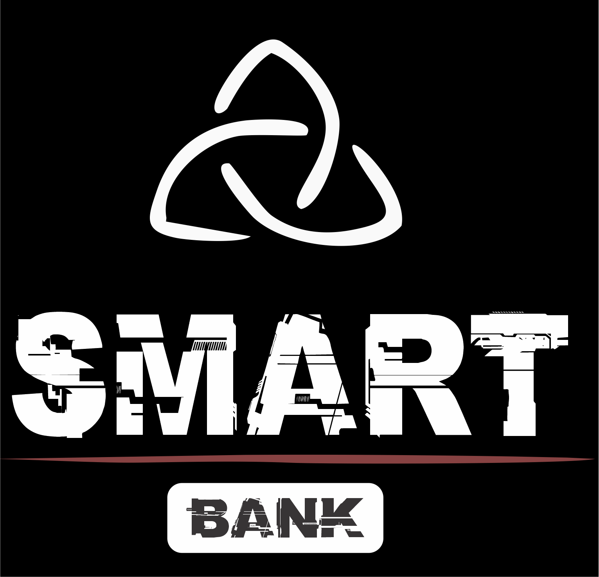

# SmartBank

<h1>Projeto para interface de um sistema Bancario</h1>

Criação do formulário de cadastro, acesso a conta e outras informações

Olá Dev(a)! Parabéns, você acaba de ser contratado e seu projeto de onboard será o desenvolvimento de um sistema de conta bancária para pessoa física.

Nessa primeira versão será contemplado:

Cadastro de clientes Depósitos Saques Consulta de saldo

